# SmartBus — Intercity Bus Ticketing & Fleet Reservation System

[](https://www.python.org/)
[]()
[]()
[]()

> **Practical Laboratory Assessment Submission**  
> Architected following software engineering standards from **Lab 2**, **Lab 3**, **Lab 4**, and **Lab 5**.  
> Features SQLite persistence, strict Object-Oriented encapsulation, 3-tabbed GUI, atomic double-booking prevention, and an interactive visual seat layout with statutory concession verification.

---

## 1. System Requirements Specification

In accordance with software engineering principles, the system is designed around balanced **Functional Requirements (FR)** and **Non-Functional Requirements (NFR)**:

| Requirement Classification | Functional Requirements (FR) | Non-Functional Requirements (NFR) |
| :--- | :--- | :--- |
| **Core Definition** | Define **what** the system should do (features & system functionality). | Define **how** the system should perform (quality attributes & operational constraints). |
| **Focus** | Focus on system behavior, user interaction, and transactional operations. | Focus on performance, security, data integrity, and code maintainability. |
| **Scope of Actions** | Describes specific actions like route querying, seat booking, ticket issuance, and ticket cancellations. | Describes constraints like response times (<100ms), input sanitization, and OOP extensibility. |
| **Visibility** | Directly visible to users, passengers, and business operations. | Indirectly visible, governing architectural robustness and long-term maintainability. |
| **Validation Metric** | Output-based validation (e.g., ticket generated with seat assignment, seats released upon cancellation). | Metrics-based validation (e.g., zero double-bookings via SQLite partial unique indexes, regex PII validation). |
| **Design Driver** | Drives the core user workflows and interactive GUI features. | Influences database constraints, OOP architectural layering, and security protocols. |
| **Documentation** | Documented using use case specifications, step-by-step user stories, and sequence diagrams. | Documented using technical specs, performance criteria, and data dictionaries. |

### 1.1 The 2 Functional Requirements (FR)

* **FR-1: Route Schedule Browsing & Interactive Seat Selection**  
  * *Description*: The system shall allow commuters and dispatchers to browse intercity bus schedules (origin, destination, departure time, and base fare) and dynamically select an available seat through a visual 2×2 bus cabin layout.
  * *Inputs*: Route selection from dropdown, travel date (`YYYY-MM-DD`), and visual seat grid click.
  * *Expected Output*: Real-time seat state toggling, passenger qualification checks, and live fare calculation.

* **FR-2: Booking Processing, Ticket Issuance & Lifecycle Cancellation**  
  * *Description*: The system shall process confirmed seat reservations into persistent SQLite records, generate tamper-resistant verification codes, and support ticket cancellation with immediate seat inventory release and audit logging.
  * *Inputs*: Passenger details (Name, Contact, Classification, ID proof) and Ticket ID / Reference Code lookup.
  * *Expected Output*: Ticket record created in `tickets` table; cancellation updates status to `Cancelled` and frees the seat for subsequent passengers.

---

### 2. The 2 Non-Functional Requirements (NFR)

* **NFR-1: Security, Validation & Tamper Resistance**  
  * *Quality Attribute*: **Security & Data Integrity**
  * *Specification*: All passenger inputs must undergo strict sanitization. Contact numbers must conform to standard mobile telephone formats (`09XXXXXXXXX` or `+639XXXXXXXXX`). Concession fare discounts require mandatory verification of official institutional/government ID credentials (minimum 4 characters). Every ticket is issued with an 8-character cryptographically salted SHA-256 reference code (`BTK-[HEX]`) to prevent ticket counterfeiting.

* **NFR-2: Maintainability, Clean Architecture & Double-Booking Prevention**  
  * *Quality Attribute*: **Maintainability, Reliability & ACID Concurrency**
  * *Specification*: The codebase strictly enforces Object-Oriented encapsulation (private `_` attributes, `@property` getters, and `@setter` validation raising `TypeError` or `ValueError`) conforming to PEP 8 standards. At the database layer, an ACID-compliant SQLite schema with a partial unique index (`ON tickets (route_id, travel_date, seat_number) WHERE status = 'Confirmed'`) mathematically guarantees that no seat can ever be double-booked.

---

## 3. Unique System Use Case

### **Interactive Visual Seat Layout Matrix with Senior/PWD Priority Allocation & Concession Discount Engine**

* **Use Case ID**: `UC-SMARTBUS-01`
* **Actor**: Passenger / Transit Booking Officer
* **Preconditions**: SQLite database is initialized with active routes and assigned fleet buses.
* **Core Flow**:
  1. The user selects an intercity route (e.g., `RT-101: Manila (Cubao) -> Baguio City`) and travel date.
  2. The system queries SQLite and dynamically renders a **2×2 Cabin Seating Matrix** featuring a center aisle:
     * **Row 1 (Seats 1, 2, 3, 4)** are designated **Priority Seats**, color-coded in vibrant **Amber**.
     * **Rows 2 to 6** are designated **Regular Seats**, color-coded in **Green** (Available) or **Red** (Booked).
  3. When an available seat is clicked, it highlights in **Blue** (`[✓]`).
  4. If a non-priority commuter selects a Row 1 priority seat, the system triggers a policy verification prompt.
  5. The commuter selects their passenger category:
     * **Regular**: Standard base fare charged.
     * **Senior Citizen / PWD / Student**: The system enables the Concession ID entry field and automatically deducts a statutory **20% fare discount** (e.g., PHP 580.00 base fare yields a PHP 116.00 discount, for a net payable amount of PHP 464.00).
  6. Upon confirming booking, the system atomically commits the reservation to SQLite, marks the seat as occupied (`[X]`), and issues the verified ticket.
* **Postconditions**: The seat is locked against duplicate bookings in SQLite; the passenger receives a printable boarding pass.

---

## 4. System Architecture & Relational Schema

### 4.1 Layered Architecture Pattern

The system follows a Model-View-Controller (MVC) structure decoupled via the Repository/Singleton pattern:

```
+-------------------------------------------------------------------------+
|                        PRESENTATION LAYER (View)                        |
|   - Tkinter GUI Subclass (app.py: BusTicketingApp)                      |
|   - Multi-Tab ttk.Notebook (Tabs 1, 2, 3) & ttk.Treeview Tables         |
|   - Interactive Seat Canvas/Grid & Modal Boarding Pass Dialog           |
+------------------------------------+------------------------------------+
                                     | Event Triggers & Form Data
                                     v
+-------------------------------------------------------------------------+
|                     BUSINESS LOGIC & FACTORY LAYER                      |
|   - TicketFactory (models/factory.py: Fare calc, concession checks)     |
|   - BusFactory (models/factory.py: Fleet cabin configuration)           |
|   - Domain Models: Route, Bus, Passenger, Ticket, TicketStatus          |
+------------------------------------+------------------------------------+
                                     | Verified Domain Objects
                                     v
+-------------------------------------------------------------------------+
|                      DATA ACCESS & PERSISTENCE LAYER                    |
|   - BusTicketingDatabase Singleton (models/database.py)                 |
|   - Parameterized SQL Queries & Context-Managed Connections             |
|   - Partial Unique Indexes for Double-Booking Prevention                |
+------------------------------------+------------------------------------+
                                     | ACID Transactions
                                     v
+-------------------------------------------------------------------------+
|                          SQLITE DATABASE ENGINE                         |
|   - Local Relational File: 'bus_ticketing.db'                           |
+-------------------------------------------------------------------------+
```

### 4.2 SQLite Relational Database Schema

```sql
-- 1. Routes Table
CREATE TABLE routes (
    route_id TEXT PRIMARY KEY,
    origin TEXT NOT NULL,
    destination TEXT NOT NULL,
    distance_km REAL NOT NULL,
    base_fare REAL NOT NULL,
    departure_time TEXT NOT NULL,
    bus_id TEXT NOT NULL
);

-- 2. Buses Table
CREATE TABLE buses (
    bus_id TEXT PRIMARY KEY,
    bus_number TEXT NOT NULL,
    bus_type TEXT NOT NULL,
    total_seats INTEGER NOT NULL,
    layout_rows INTEGER NOT NULL,
    layout_cols INTEGER NOT NULL,
    priority_seats_json TEXT NOT NULL
);

-- 3. Passengers Table
CREATE TABLE passengers (
    passenger_id TEXT PRIMARY KEY,
    name TEXT NOT NULL,
    contact_number TEXT NOT NULL,
    passenger_type TEXT NOT NULL,
    discount_id TEXT
);

-- 4. Tickets Table (with Foreign Keys & Concession Audit)
CREATE TABLE tickets (
    ticket_id TEXT PRIMARY KEY,
    booking_reference TEXT UNIQUE NOT NULL,
    route_id TEXT NOT NULL,
    bus_id TEXT NOT NULL,
    passenger_id TEXT NOT NULL,
    seat_number INTEGER NOT NULL,
    travel_date TEXT NOT NULL,
    base_fare REAL NOT NULL,
    discount_amount REAL NOT NULL,
    final_fare REAL NOT NULL,
    status TEXT NOT NULL,
    booking_time TEXT NOT NULL,
    cancellation_time TEXT,
    cancellation_reason TEXT,
    FOREIGN KEY (route_id) REFERENCES routes(route_id),
    FOREIGN KEY (bus_id) REFERENCES buses(bus_id),
    FOREIGN KEY (passenger_id) REFERENCES passengers(passenger_id)
);

-- Strict Double-Booking Prevention (NFR-2)
CREATE UNIQUE INDEX idx_unique_active_seat
ON tickets (route_id, travel_date, seat_number)
WHERE status = 'Confirmed';
```

---

## 5. Process Flowcharts & Workflows

### 5.1 Standard Flowchart: Ticket Booking & Concession Allocation (FR-1 & Unique Use Case)
Standard flowchart utilizing ISO/ANSI flowchart shapes: **Terminator capsules** (Start/End), **Input/Output parallelograms**, **Process rectangles**, **Decision diamonds** (Yes/No branches), and **Database cylinders** (SQLite queries):

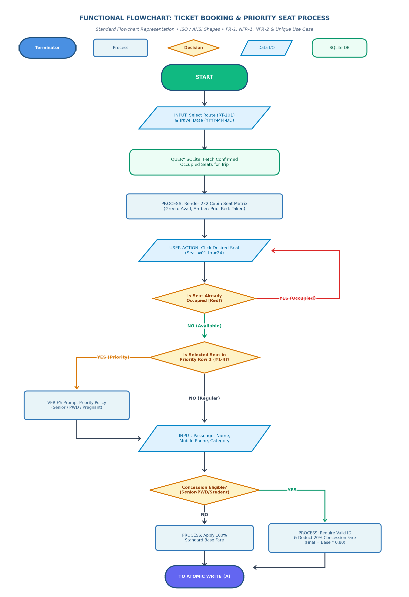

```mermaid
flowchart TD
    Start([User Initiates Booking]) --> SelectRoute[/Input: Select Route & Travel Date/]
    SelectRoute --> QueryDB[(Query SQLite for Booked Seats)]
    QueryDB --> RenderGrid[Render 2x2 Interactive Seat Grid\nGreen: Available | Red: Booked | Amber: Priority]
    RenderGrid --> ClickSeat[/User Clicks Desired Seat/]
    
    ClickSeat --> IsOccupied{Is Seat Already\nOccupied?}
    IsOccupied -- Yes --> AlertOccupied[Show Warning: Seat Already Booked]
    AlertOccupied --> ClickSeat
    
    IsOccupied -- No --> CheckPriority{Is Seat in Priority Row?\nRows 1 & 2}
    CheckPriority -- Yes --> PromptPriority[Verify Senior / PWD Eligibility]
    CheckPriority -- No --> SelectSeat[Highlight Seat Blue [✓]]
    PromptPriority --> SelectSeat
    
    SelectSeat --> EnterDetails[/Input: Name, Phone & Category/]
    EnterDetails --> SelectCategory{Select Classification}
    
    SelectCategory -- Regular --> CalcRegular[Base Fare Applied\n0% Discount]
    SelectCategory -- Senior / PWD / Student --> RequireID[/Input: Concession ID/]
    RequireID --> CalcDiscount[Apply 20% Concession Deduction\nFinal = Base * 0.80]
    
    CalcRegular --> SubmitBooking[Click Confirm & Issue Ticket]
    CalcDiscount --> SubmitBooking
    
    SubmitBooking --> ValidatePII{Validate PII Regex &\nConcession ID Proof}
    ValidatePII -- Invalid --> DisplayError[Show Validation Error Alert]
    DisplayError --> EnterDetails
    
    ValidatePII -- Valid --> GenHash[Generate Salted SHA-256 Code\nBTK-XXXXXX]
    GenHash --> AtomicInsert[(Begin SQLite Transaction\nInsert Ticket & Passenger)]
    
    AtomicInsert -- Collision Detected --> Rollback[Rollback Transaction & Alert Conflict]
    AtomicInsert -- Success --> CommitDB[Commit SQLite Transaction]
    CommitDB --> RefreshUI[Update Seat Grid to Red [X]\nIncrement Analytics KPI & Issue Boarding Pass]
    RefreshUI --> End([Booking Complete])
```

### 5.2 Standard Flowchart: Ticket Cancellation & Seat Release (FR-2)
Standard flowchart for lifecycle ticket cancellation and automatic seat restoration:

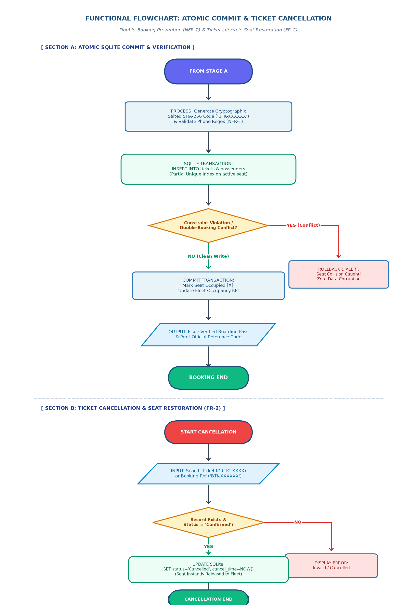

### 5.3 High-Level Architecture & Relational Data Flow
Layered Model-View-Controller architecture and data flow through SQLite:

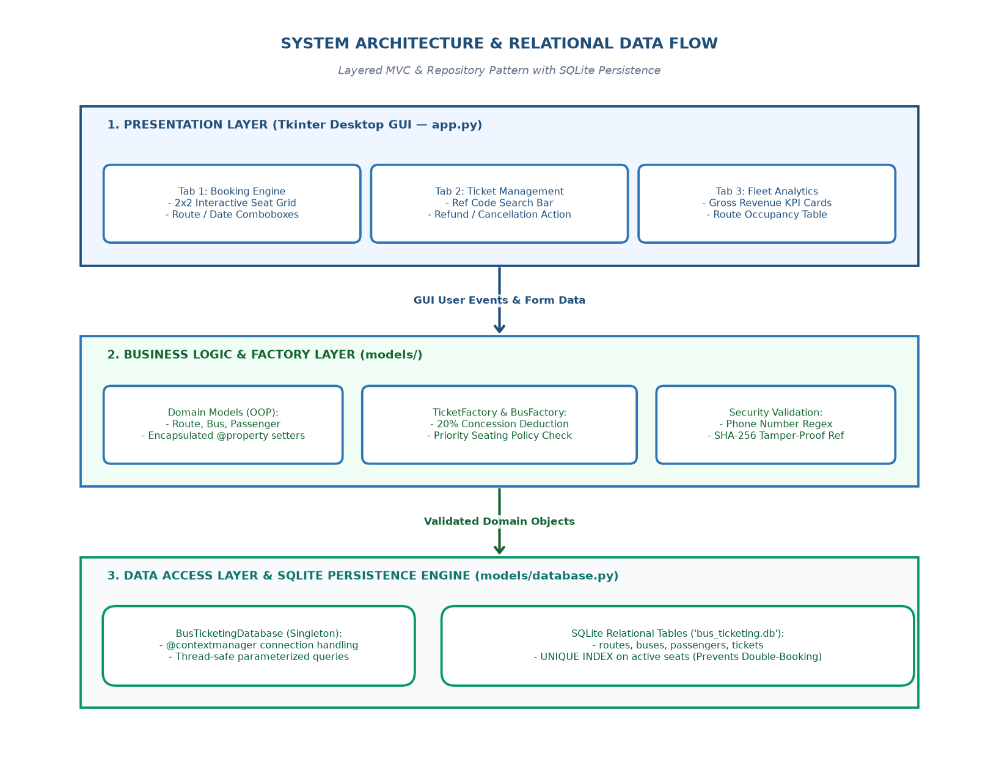

---

## 6. UI Wireframes & Visual Layouts

### Tab 1 Wireframe: Book Tickets & Visual Seat Map
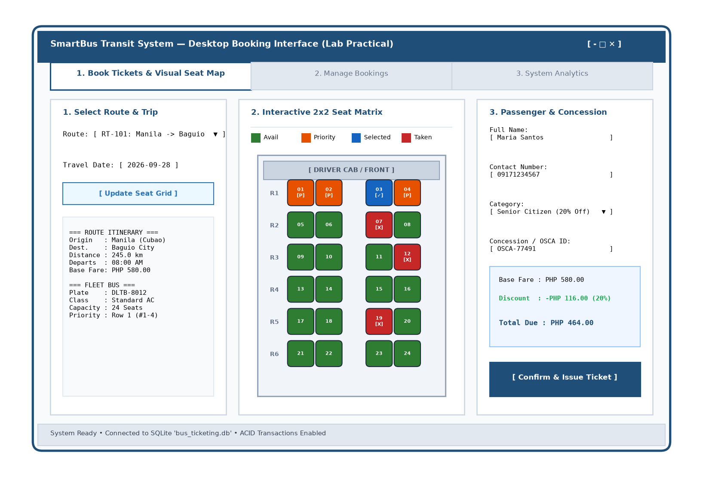

### Tab 2 Wireframe: Manage Bookings & Audit Dossier
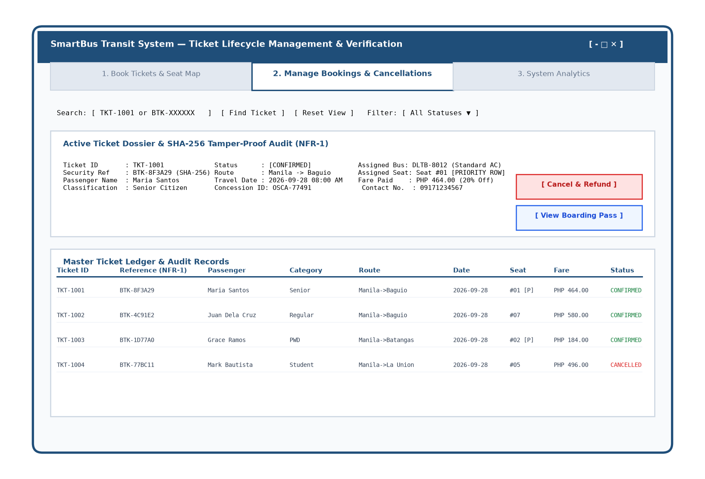

### Tab 3 Wireframe: System Overview & Fleet Analytics
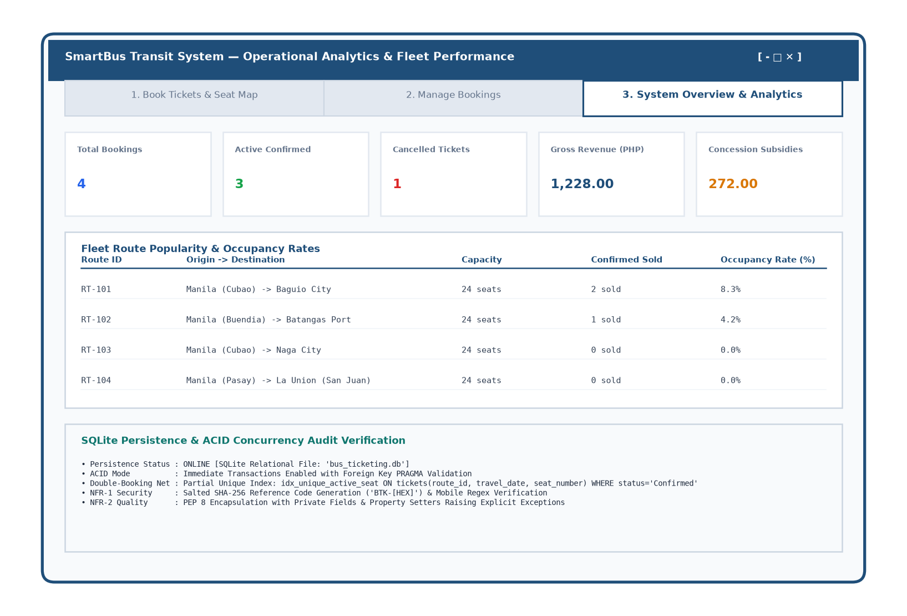

---

## 7. Live Interface Screenshots

| Milestone & Scenario | Live Screen Capture |
| :--- | :--- |
| **01. Tab 1 Default View**<br>Route selection, trip itinerary, and 2×2 visual seat map with Row 1 Priority seats. |  |
| **02. Priority Seat & Concession**<br>Seat #01 selected, Senior Citizen OSCA ID verified, 20% concession quoted. | 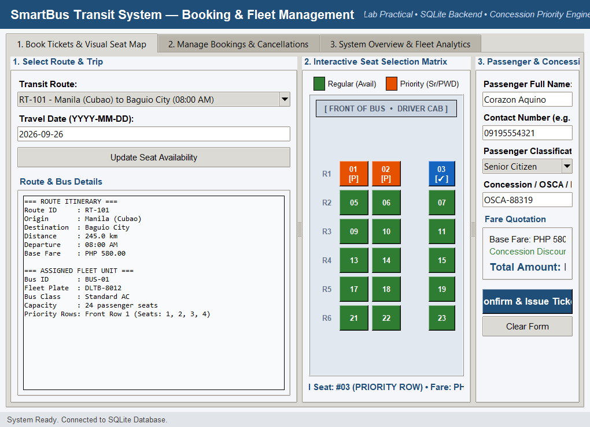 |
| **03. Issued Ticket Confirmation**<br>Atomic SQLite write, seat marked occupied `[X]`, status bar updated. | 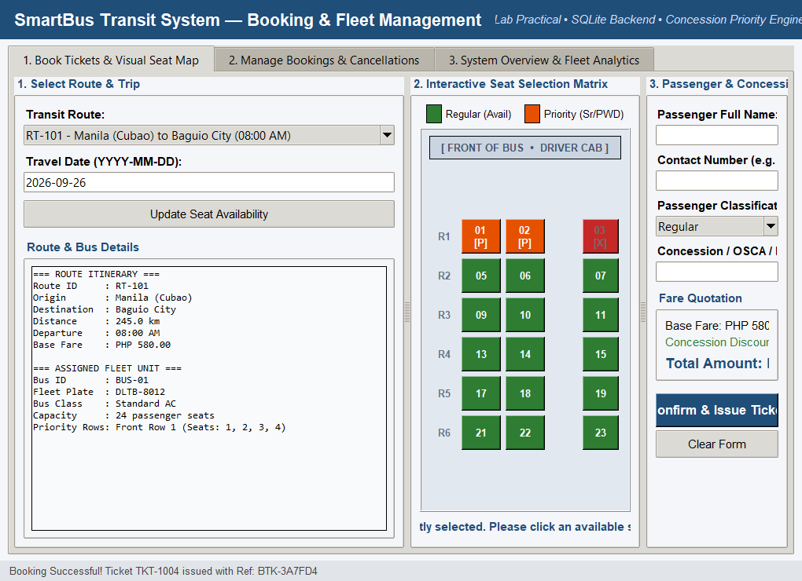 |
| **04. Tab 2 Manage Bookings**<br>Master ticket list with search filters and status badges. | 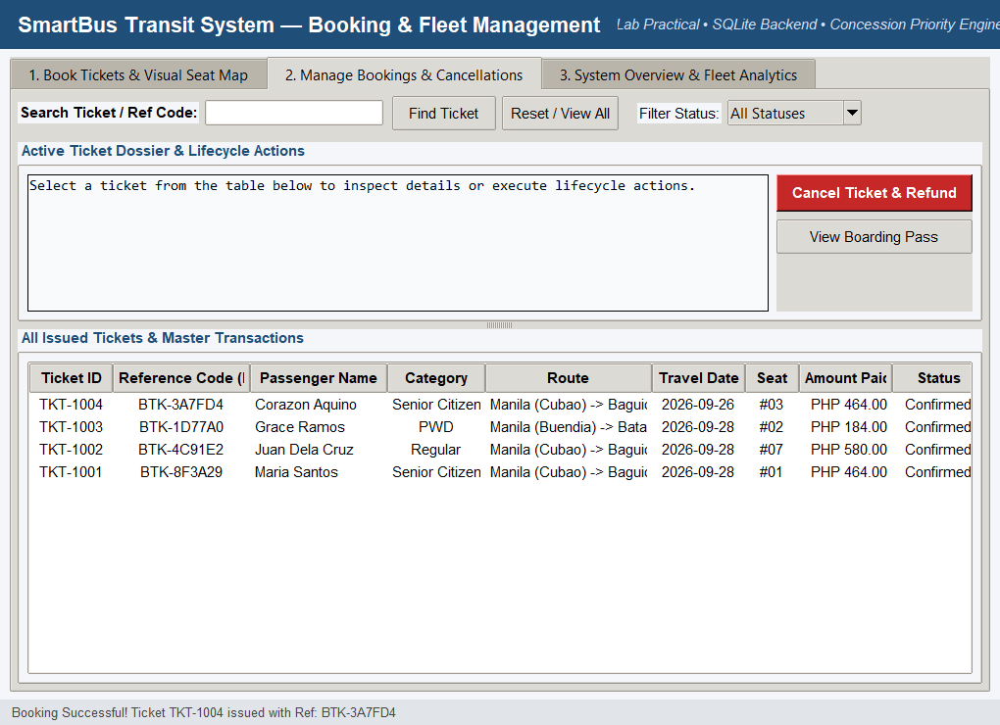 |
| **05. Ticket Dossier Inspection**<br>Inspection card with SHA-256 verification and priority seat validation. | 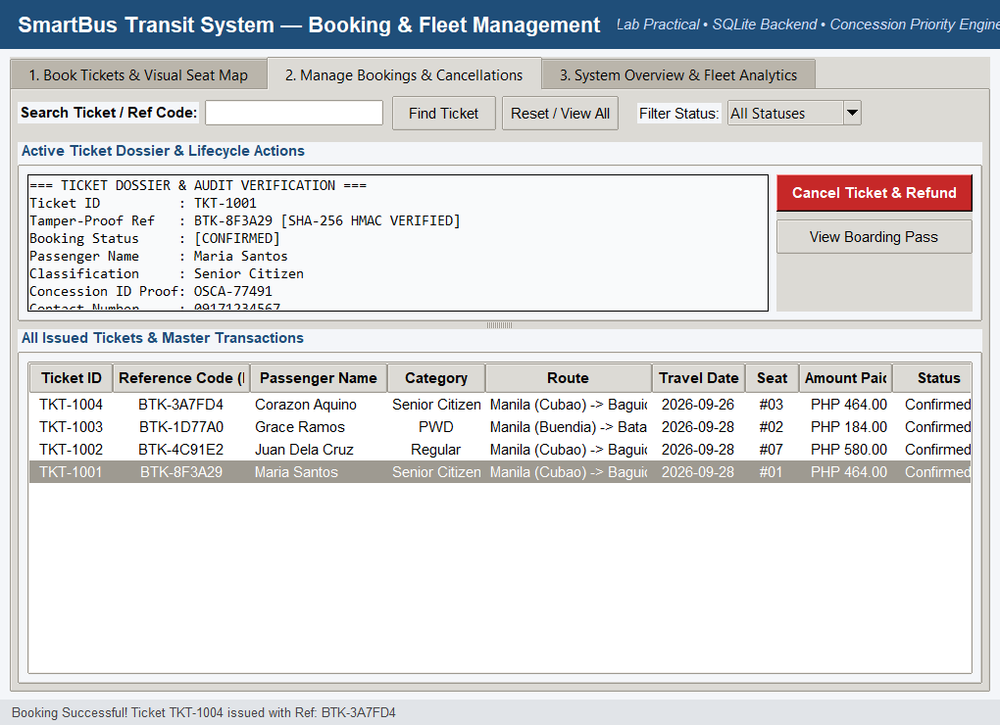 |
| **06. Official Boarding Pass**<br>High-fidelity modal dialog for terminal commuter boarding. | 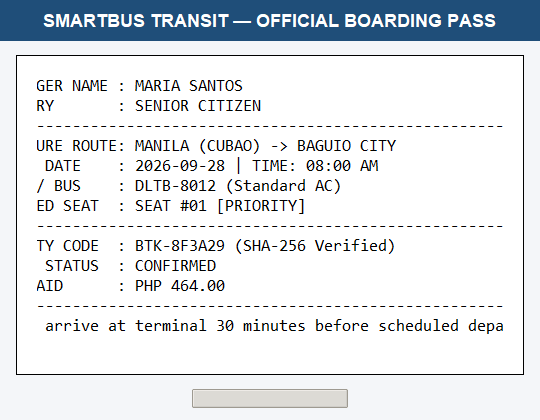 |
| **07. Ticket Cancellation**<br>Cancelled ticket lifecycle transition with immediate seat inventory release. | 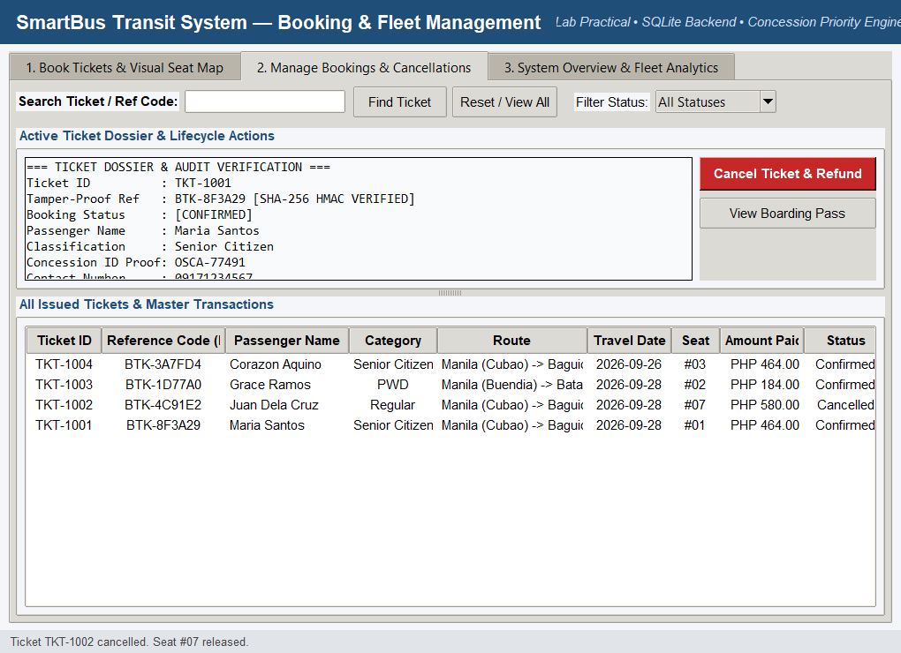 |
| **08. Tab 3 System Analytics**<br>Gross revenue cards, concession subsidies, and route occupancy rates. | 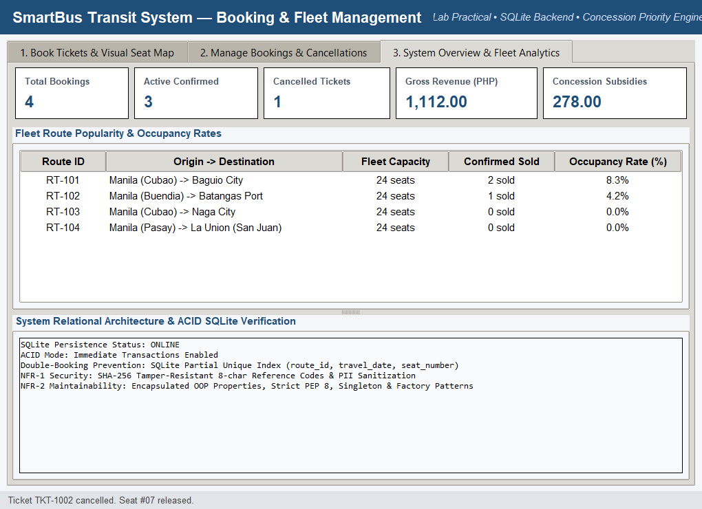 |
| **09. Unit Test Suite Execution**<br>All 12 unit tests passing 100% via `unittest.TestCase`. | 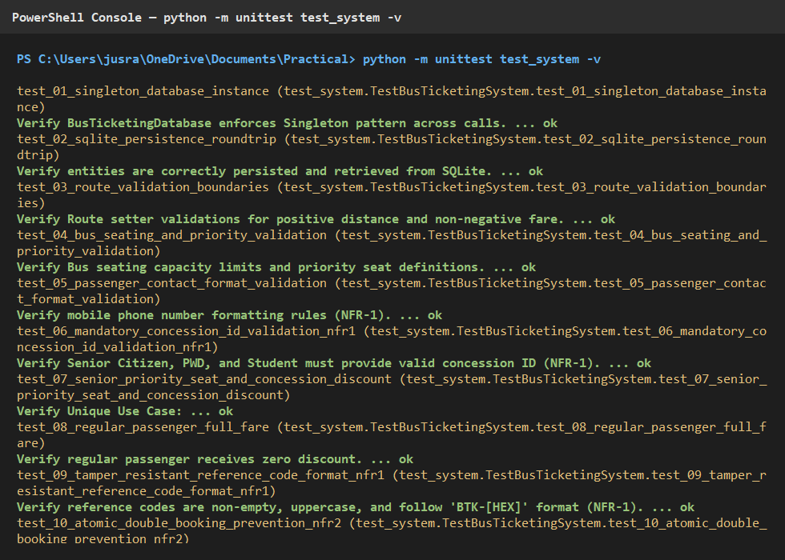 |

---

## 8. Verification & Test Matrix

| Test ID | Test Method Name | Category | Verification Criteria | Status |
| :--- | :--- | :--- | :--- | :---: |
| **TC-01** | `test_01_singleton_database_instance` | Architecture | Verifies `BusTicketingDatabase` enforces Singleton pattern. | **PASS** |
| **TC-02** | `test_02_sqlite_persistence_roundtrip` | Persistence | Verifies SQLite CRUD operations for Routes and Buses. | **PASS** |
| **TC-03** | `test_03_route_validation_boundaries` | NFR-2 | Verifies positive distance and non-negative base fare constraints. | **PASS** |
| **TC-04** | `test_04_bus_seating_and_priority_validation` | NFR-2 | Verifies seating bounds and priority seat designations. | **PASS** |
| **TC-05** | `test_05_passenger_contact_format_validation` | NFR-1 | Verifies mobile contact regex sanitization. | **PASS** |
| **TC-06** | `test_06_mandatory_concession_id_validation_nfr1` | NFR-1 | Verifies mandatory concession ID check for Senior, PWD, and Student. | **PASS** |
| **TC-07** | `test_07_senior_priority_seat_and_concession_discount`| Unique UC | Verifies Row 1 priority seat booking with statutory 20% discount. | **PASS** |
| **TC-08** | `test_08_regular_passenger_full_fare` | FR-1 | Verifies regular passengers receive standard undiscounted fare. | **PASS** |
| **TC-09** | `test_09_tamper_resistant_reference_code_format_nfr1` | NFR-1 | Verifies cryptographically salted SHA-256 reference codes. | **PASS** |
| **TC-10** | `test_10_atomic_double_booking_prevention_nfr2` | NFR-2 | Verifies duplicate seat booking raises `ValueError` & rolls back. | **PASS** |
| **TC-11** | `test_11_ticket_cancellation_releases_seat_fr2` | FR-2 | Verifies cancelled ticket releases seat for immediate re-booking. | **PASS** |
| **TC-12** | `test_12_analytics_calculation` | Metrics | Verifies gross revenue, ticket counters, and subsidy calculations. | **PASS** |

---

## 9. Installation & Execution Guide

### Prerequisites
* Python 3.10+ (Standard distribution)
* SQLite3 (Included natively in Python standard library)
* Tkinter & Pillow (`pip install pillow`)

### Running the Application
Launch the graphical interface pre-loaded with sample routes, buses, and bookings:
```powershell
python main.py
```

### Running the Unit Test Suite
Execute the automated test suite with verbose output:
```powershell
python -m unittest test_system.py -v
```

### Capturing Automated High-Resolution Screenshots
Run the headless capture suite to regenerate all 9 screenshots into `screenshots/`:
```powershell
python capture_screenshots.py
```

---

## 10. Project Directory Tree

```
Practical/
├── models/
│   ├── __init__.py           # Re-exports all domain entities and database singleton
│   ├── bus.py                # Bus entity with cabin configuration & priority seats
│   ├── database.py           # SQLite BusTicketingDatabase singleton with ACID queries
│   ├── factory.py            # BusFactory & TicketFactory with concession calculations
│   ├── passenger.py          # Passenger entity with PII & concession ID validation
│   ├── route.py              # Route entity with travel metrics and pricing
│   └── ticket.py             # Ticket entity, TicketStatus enum, & SHA-256 ref generator
├── screenshots/              # 9 Programmatic high-resolution PNG screen captures
│   ├── 01_tab_booking_seat_map.png
│   ├── 02_selected_priority_seat.png
│   ├── 03_issued_ticket.png
│   ├── 04_tab_manage_bookings.png
│   ├── 05_ticket_dossier_inspection.png
│   ├── 06_boarding_pass_modal.png
│   ├── 07_ticket_cancellation_seat_released.png
│   ├── 08_tab_system_analytics.png
│   └── 09_unit_tests_pass.png
├── app.py                    # Main Tkinter GUI application (3 tabs, visual seat map)
├── bus_ticketing.db          # SQLite persistent database file
├── capture_screenshots.py    # Automated screenshot generation suite
├── main.py                   # System entry point with sample data pre-population
├── test_system.py            # Complete 12-test unittest suite
└── README.md                 # Complete project documentation and specifications
```
